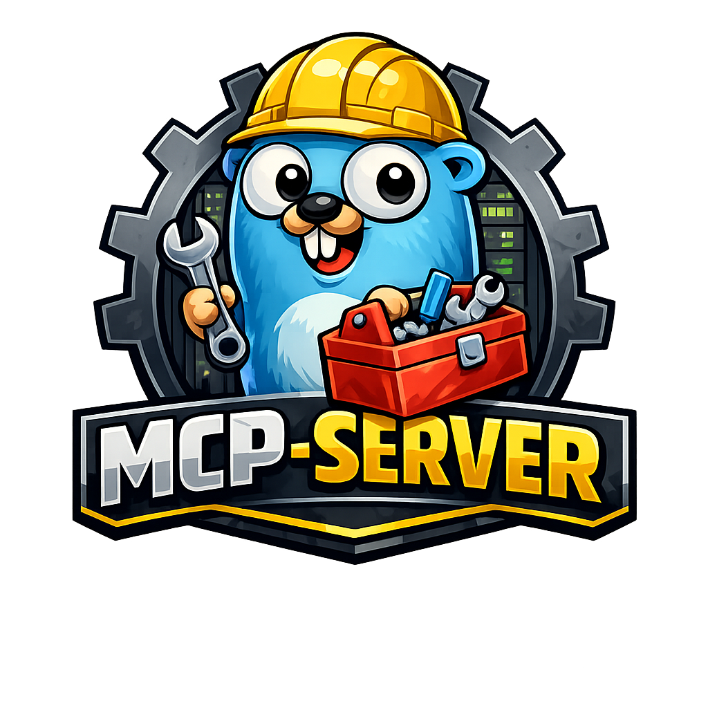

## MCP-Server



A Model Context Protocol (MCP) server built with Go, supporting both stdio and HTTP transports for integration withMCP-compatible clients.

### Features

- MCP protocol support via [go-sdk](https://github.com/modelcontextprotocol/go-sdk)
- Dual transport modes: stdio (CLI) and HTTP (Streamable HTTP)
- API key authentication middleware for HTTP transport
- Prometheus metrics with path, method, and status labels
- Structured JSON logging via `slog`
- Configuration via environment variables
- Distroless Docker image for minimal attack surface
- Comprehensive unit tests with table-driven patterns using only standard library no external test frameworks

### Tools

| Tool | Description |
|------|-------------|
| `generate_uuid` | Generate a UUID v4 |

> **Want to add your own tool?** Check out the [Developer Guide](DEVELOPER_GUIDE.md) for a step-by-step walkthrough.

### Endpoints (HTTP Transport)

| Endpoint | Method | Auth Required | Description |
|----------|--------|---------------|-------------|
| `/health` | GET | No | Health check |
| `/metrics` | GET | No | Prometheus metrics |
| `/mcp` | POST | Yes* | MCP HTTP endpoint |

*When `AUTH_ENABLED=true`

### Quick Start

```bash
# Show available make targets
make

# Copy and configure environment
make config

# Build and run locally (stdio mode)
make run

# Run with HTTP transport
MCP_TRANSPORT=http make run

# Run with Docker Compose
make docker-up

# Run tests
make test
```

### Configuration

All configuration is via environment variables.

| Variable | Default | Description |
|----------|---------|-------------|
| `PORT` | `8080` | Server port |
| `MCP_TRANSPORT` | `stdio` | Transport mode: `stdio` or `http` |
| `AUTH_ENABLED` | `false` | Enable API key authentication (HTTP only) |
| `API_KEYS` | | Comma-separated list of valid API keys |

```bash
# Example: Run HTTP with authentication
MCP_TRANSPORT=http AUTH_ENABLED=true API_KEYS="key1,key2" make run
```

### Transport Modes

**Stdio (default):** For use with Claude Desktop and CLI tools. The server communicates via stdin/stdout.

```bash
make run
```

**HTTP:** For HTTP-based deployments. Exposes the MCP protocol over Streamable HTTP.

```bash
MCP_TRANSPORT=http make run
```

### Authentication

For simplicity API key authentication is implemented in the middleware. This can obviously be replaced with a more robust solution as needed.

When `AUTH_ENABLED=true`, the `/mcp` endpoint requires a valid API key in the `X-API-Key` header.

```bash
# Generate a secure API key
openssl rand -hex 32

# Request with API key
curl -X POST http://localhost:8080/mcp \
  -H "X-API-Key: your-api-key" \
  -H "Content-Type: application/json" \
  -d '{"jsonrpc":"2.0","method":"initialize","id":1,"params":{...}}'
```

Unauthenticated requests return `401 Unauthorized`:
```json
{"error":"missing API key"}
```

Invalid keys return:
```json
{"error":"invalid API key"}
```

### Claude Code Integration - Example Config

For Claude Code with HTTP transport:

```json
{
  "mcpServers": {
    "mcp-server": {
      "type": "http",
      "url": "http://localhost:8080/mcp",
      "headers": {
        "X-API-Key": "your-api-key"
      }
    }
  }
}
```

### Curl Examples

Health Check:
```bash
curl http://localhost:8080/health
```

Metrics:
```bash
curl http://localhost:8080/metrics
```

MCP Initialize (with auth):
```bash
curl -X POST http://localhost:8080/mcp \
  -H "X-API-Key: your-api-key" \
  -H "Content-Type: application/json" \
  -d '{"jsonrpc":"2.0","method":"initialize","id":1,"params":{"protocolVersion":"2024-11-05","capabilities":{},"clientInfo":{"name":"test","version":"1.0"}}}'
```

### Docker

The Docker image uses a multi-stage build with a distroless runtime image for security.

```bash
# Build and run standalone container (HTTP mode)
make docker-run

# Run with auth enabled
AUTH_ENABLED=true API_KEYS="secret-key" make docker-run

# Stop and remove container
make docker-clean
```

#### Docker Compose

```bash
# Start services
make docker-up

# View logs
make docker-logs

# Restart services
make docker-restart

# Stop services
make docker-down
```

### Project Structure

```
.
├── cmd/                      # Application entrypoint
│   └── mcp-server.go         # Main server with transport switching
├── internal/
│   ├── config/               # Environment configuration
│   ├── handlers/             # HTTP handlers (health)
│   ├── middleware/           # Auth and metrics middleware
│   └── tools/                # MCP tool implementations
│       └── uuid/             # UUID generation tool
├── example.env               # Example environment file
├── docker-compose.yml        # Docker Compose configuration
├── Dockerfile                # Multi-stage distroless build
├── Makefile                  # Build and run targets
├── DEVELOPER_GUIDE.md        # Guide for adding new tools
└── README.md                 # This file
```

### Development

```bash
# Run tests
make test

# Run tests with verbose output
make test-verbose

# Run tests with coverage
make coverage

# Generate HTML coverage report
make coverage-html

# Run linter
make lint

# Format code
make fmt
```

### Adding Tools

See [DEVELOPER_GUIDE.md](DEVELOPER_GUIDE.md) for a complete walkthrough on adding new tools.

Quick overview:

1. Create a new package in `internal/tools/<toolname>/`
2. Implement the tool with Input/Output structs
3. Register via `init()` with `tools.Register()`
4. Add blank import in `cmd/mcp-server.go`

Example:
```go
package mytool

import (
    "context"

    "github.com/modelcontextprotocol/go-sdk/mcp"
    "github.com/lkendrickd/mcp-server/internal/tools"
)

type Input struct {
    Name string `json:"name" jsonschema:"description=The name to greet"`
}

type Output struct {
    Message string `json:"message"`
}

func Greet(_ context.Context, _ *mcp.CallToolRequest, input Input) (*mcp.CallToolResult, Output, error) {
    return nil, Output{Message: "Hello, " + input.Name}, nil
}

func init() {
    tools.Register(func(s *mcp.Server) {
        mcp.AddTool(s, &mcp.Tool{
            Name:        "greet",
            Description: "Greet someone by name",
        }, Greet)
    })
}
```

### Make Targets

```bash
make help  # Show all available targets
```

| Target | Description |
|--------|-------------|
| `make` | Show help |
| `make config` | Create .env from example.env |
| `make build` | Build the binary |
| `make run` | Build and run locally |
| `make test` | Run unit tests |
| `make test-verbose` | Run tests with verbose output |
| `make coverage` | Run tests with coverage |
| `make lint` | Run golangci-lint |
| `make fmt` | Format code |
| `make docker-build` | Build Docker image |
| `make docker-run` | Build and run container |
| `make docker-clean` | Stop and remove container |
| `make docker-up` | Start with docker-compose |
| `make docker-down` | Stop docker-compose |
| `make docker-logs` | View docker-compose logs |
| `make docker-restart` | Restart docker-compose |
