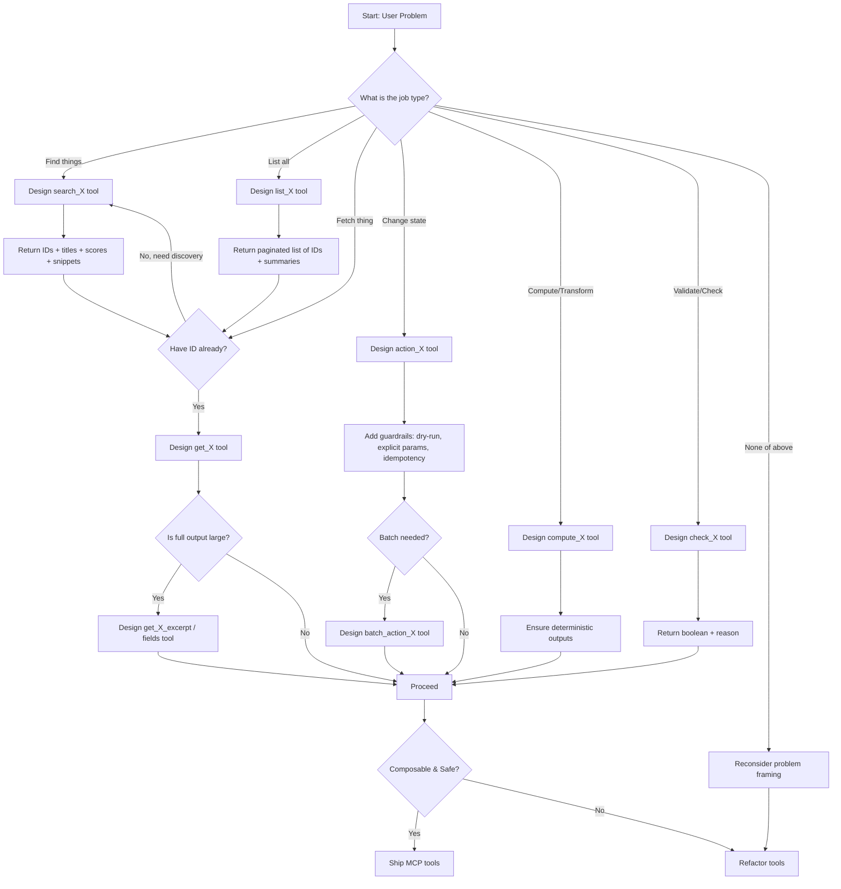

# MCP Tool Design Flowchart

This flowchart outlines the decision-making process for designing MCP (Model Context Protocol) tools based on user problems. It helps in determining the appropriate tool type and necessary features to ensure safety, composability, and efficiency.

